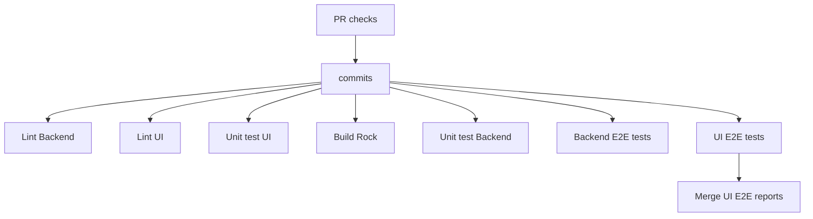

# Cluster Manager architecture

See [Architecture of the MicroCloud Cluster Manager](https://documentation.ubuntu.com/microcloud/latest/microcloud/reference/cluster-manager-architecture/) for an architecture diagram and further details.

## Workflows

### PR checks with CI pipeline

For each pull request opened or updated, a series of checks will be applied using [PR GitHub workflow](https://github.com/canonical/microcloud-cluster-manager/actions/workflows/pr.yaml) to ensure code quality.

The most critical CI jobs are the `Backend E2E tests` and the `UI E2E tests` because they execute the end-to-end test suites against the current state of the pull request, thereby preventing regression errors.

Both E2E test scripts use the [run-backend](test/run-backend.sh) script to boot a local instance of the cluster manager. This approach ensures that the tests are reliable and fast.

## Code coverage

A dedicated [TICS code scan](https://github.com/canonical/microcloud-cluster-manager/actions/workflows/tics.yaml) workflow is running the unit and e2e tests.

The coverage report uses the [run-coverage](test/run-coverage.sh) script to boot a local instance of the cluster manager with coverage reporting enabled. This allows the workflow to collect coverage data from both the backend and the UI. Providing a comprehensive view of the code coverage for the entire project.
