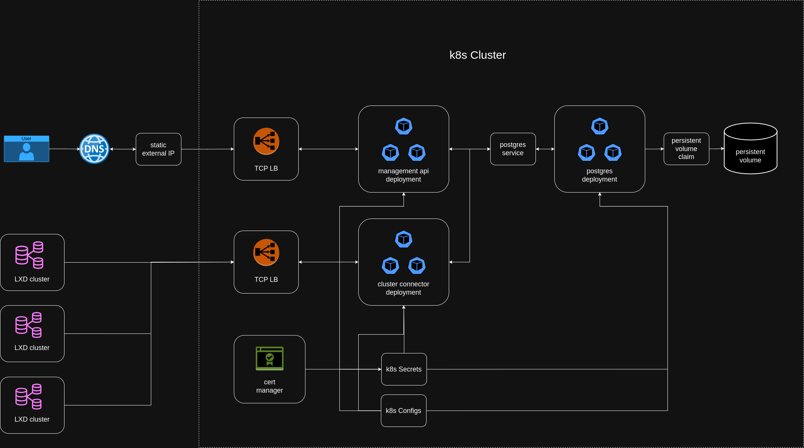
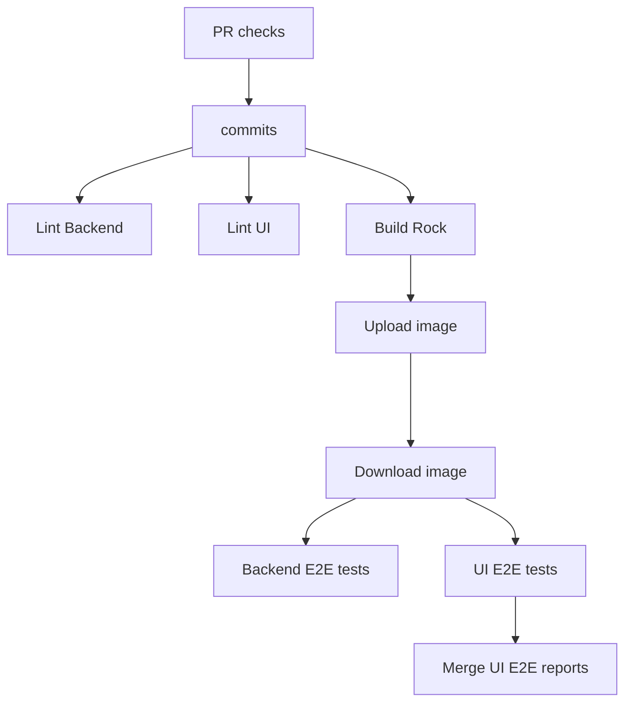

# Cluster Manager Architecture

 

## System overview

LXD Cluster Manager is a centralized tool for viewing and managing LXD clusters. It is a highly available web application with a browser-based UI that facilitates user interaction with the system.

Since LXD clusters are often hosted in air-gapped environments, it is assumed that Cluster Manager cannot directly reach an LXD cluster. This implies that network communication is unidirectional, from LXD clusters to Cluster Manager only.

The Cluster Manager requires an OIDC provider to be set up for user authentication. Once authenticated, users will be able to access the UI fully and manage registered LXD clusters.

To connect an LXD cluster, a join token must be generated in Cluster Manager and manually sent to an LXD admin. The join token will need to be consumed by an LXD cluster to register Cluster Manager details such as available network addresses. The LXD cluster will then send a join request to Cluster Manager, with the payload signed using an HMAC key generated from the join token secret. Once Cluster Manager receives the join request, it will validate the HMAC key. If successful, it will store the LXD cluster details with a `PENDING_APPROVAL` status. A Cluster Manager user will need to approve or reject the join request.

Once the LXD cluster is connected, it will send status updates to Cluster Manager at periodic intervals. The data will be stored by Cluster Manager and displayed via the browser UI. Communication between an LXD cluster and Cluster Manager after the initial join request will be authenticated using mTLS.

 

## Distributed architecture
LXD Cluster Manager is a distributed web application, planned for Kubernetes cluster deployment to achieve high availability. The system architecture is presented in the image below:

The various system components shown above are desbribed in detail below:

#### 1. DNS and Static External IP

The Domain Name Server (DNS) will be setup by the user to resolve their domain names to the static external IP.

The static external IP acts as the gateway to route user traffic to the appropriate Kubernetes load balancer.

#### 2. TCP Load Balancers

Two TCP load balancer service resources distribute traffic to the Management API and Cluster Connector deployments without terminating SSL. Instead, TLS termination is handled directly within each deployment application. This approach is particularly crucial for the Cluster Connector deployment, as it relies on Mutual TLS (mTLS) authentication for secure communication.

#### 3. Cert manager

Manages TLS/SSL certificates for secure communication within the Kubernetes cluster. It stores secrets in Kubernetes to be used by various components. The certificates are used by both Management API and Cluster Connector deployments for HTTPs encryption.

#### 4. Postgres database

A PostgreSQL database deployed within the Kubernetes cluster. It provides persistent storage for system data. Both Management API and Cluster Connector will communicate with the Postgres database for CRUD operations.

#### 5. Persistent Volume (PV) and Persistent Volume Claim (PVC)

The persistent volume is the storage resource provisioned for the Postgres deployment. The persistent volume claim is the request for storage by the Postgres deployment to ensure data persistence.

#### 6. Management API deployment

Responsible for serving the UI static assets, exposing API endpoints for the UI to communicate with LXD Cluster Manager backend. Requests from the UI are authenticated using OIDC.

#### 7. Cluster Connector deployment

Responsible for handling requests from remote LXD clusters, which are authenticated using mTLS.

 

## CI Pipeline

For each pull request opened/updated, a series of checks will be applied using Github workflow to ensure code quality.

The most critical CI jobs are `Backend E2E tests` and `UI E2E tests` because they execute the end-to-end test suites against the current state of the pull request, thereby preventing regression errors.

The E2E CI jobs are executed by embedding the rock, built from the `Build Rock` step, inside of a microk8s cluster running the application. Therefore, the CI closely resembles the production environment.
