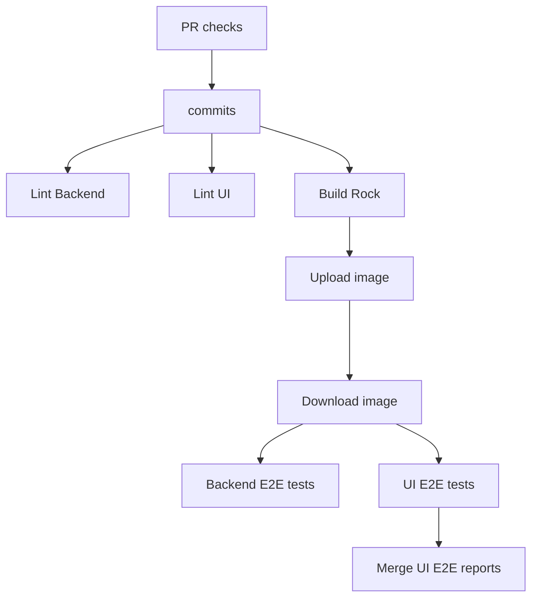

# Cluster Manager architecture

## System overview

Cluster Manager is a centralized tool for viewing and managing MicroCloud deployments. It is a highly available web application with a browser-based UI.

Since MicroClouds are often hosted in air-gapped environments, it is assumed that Cluster Manager cannot directly reach a MicroCloud. This implies that network communication is unidirectional, from MicroCloud to Cluster Manager.

Cluster Manager requires an OIDC provider to be set up for user authentication. Authenticated users will be able to access the UI and manage registered MicroClouds.

To connect a new MicroCloud, a join token must be generated in Cluster Manager. This can be done in the UI. Connect the MicroCloud with the command `microcloud cluster-manager join [token]`.

Once a MicroCloud is connected, it will send status updates to Cluster Manager at periodic intervals. Communication between MicroCloud and Cluster Manager will be authenticated using mutual TLS. The data sent to Cluster Manager is stored in Postgres and Prometheus databases. It can be displayed via the Cluster Manager UI, which also links to Grafana dashboards for each MicroCloud.

## Distributed architecture

Cluster Manager is a distributed web application, running in a Kubernetes cluster to achieve high availability. The system architecture is presented in the image below:

The various system components shown above are described in detail below:

### 1. DNS and static external IP

The Domain Name Server (DNS) will be set up by the user to resolve their domain names to a static external IP.

That static external IP acts as the gateway to route user traffic to the appropriate Kubernetes load balancer.

### 2. TCP Load Balancers

Two TCP load balancer services distribute traffic to the Management API and Cluster Connector deployments without terminating TLS. Instead, TLS termination is handled directly within each deployment application. This approach is particularly crucial for the Cluster Connector deployment, as it relies on Mutual TLS (mTLS) authentication for secure communication.

### 3. Cert manager

Manages TLS/SSL certificates for secure communication within the Kubernetes cluster. It stores secrets in Kubernetes to be used by various components. The certificates are used by both the Management API and Cluster Connector deployments for HTTPS encryption.

### 4. Postgres database

A PostgreSQL database deployed within the Kubernetes cluster. It provides persistent storage for system data. Both the Management API and Cluster Connector will communicate with the Postgres database for CRUD operations.

### 5. Persistent Volume (PV) and Persistent Volume Claim (PVC)

The persistent volume is the storage resource provisioned for the Postgres deployment. The persistent volume claim is the request for storage by the Postgres deployment to ensure data persistence.

### 6. Management API deployment

Responsible for serving the static UI assets, exposing API endpoints for the UI to communicate with the LXD Cluster Manager backend. Requests from the UI are authenticated using OIDC.

### 7. Cluster Connector deployment

Responsible for handling requests from remote LXD clusters, which are authenticated using mTLS.

 

## CI pipeline

For each pull request opened or updated, a series of checks will be applied using Github workflow to ensure code quality.

The most critical CI jobs are the `Backend E2E tests` and the `UI E2E tests` because they execute the end-to-end test suites against the current state of the pull request, thereby preventing regression errors.

The E2E CI jobs are executed by embedding the rock, built from the `Build Rock` step, inside of a microk8s cluster running the application. Therefore, the CI closely resembles the production environment.
