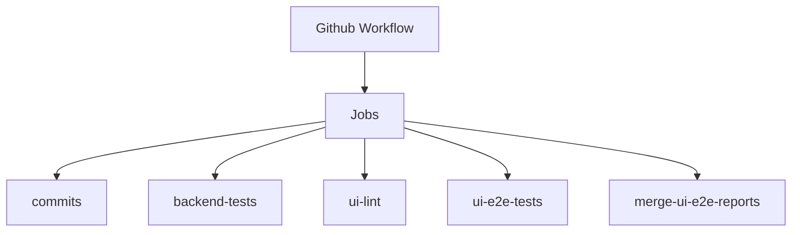
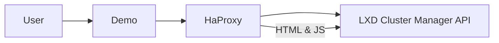

# Cluster Manager Architecture

## System overview

LXD Cluster Manager is a centralized tool for viewing and managing LXD clusters. It is a highly available web application with a browser-based UI that facilitates user interaction with the system.

Since LXD clusters are often hosted in air-gapped environments, it is assumed that Cluster Manager cannot directly reach an LXD cluster. This implies that network communication is unidirectional, from LXD clusters to Cluster Manager only.

The Cluster Manager requires an OIDC provider to be set up for user authentication. Once authenticated, users will be able to access the UI fully and manage registered LXD clusters.

To connect an LXD cluster, a join token must be generated in Cluster Manager and manually sent to an LXD admin. The join token will need to be consumed by an LXD cluster to register Cluster Manager details such as available network addresses. The LXD cluster will then send a join request to Cluster Manager, with the payload signed using an HMAC key generated from the join token secret. Once Cluster Manager receives the join request, it will validate the HMAC key. If successful, it will store the LXD cluster details with a "PENDING_APPROVAL" status. A Cluster Manager user will need to approve or reject the join request.

Once the LXD cluster is connected, it will send status updates to Cluster Manager at periodic intervals. The data will be stored by Cluster Manager and displayed via the browser UI. Communication between an LXD cluster and Cluster Manager after the initial join request will be authenticated using mTLS.

## CI Pipeline

For each pull request opened/updated, a series of checks will be applied using Github workflow to ensure code quality.

The most critical CI jobs are `backend-tests` and `ui-e2e-tests` because they execute the end-to-end test suites against the current state of the pull request, thereby preventing regression errors.

The `ui-e2e-tests` job utilizes the Playwright framework and runs tests concurrently on both Chromium and Firefox browsers. The test results are uploaded to the GitHub artifact registry and subsequently consolidated into an easy-to-digest format in the `merge-ui-e2e-reports` job.

## Demo server setup

A webhook triggers a [demo](https://github.com/canonical/demos.haus) build for any opened or updated pull request created by a collaborator of the repository. The build is configured in [Dockerfile](Dockerfile) and produces an image, which is run in the demo k8s cluster. The cluster provides several secrets, which are read from the [site.yaml](konf/site.yaml) file and used in the [entrypoint](entrypoint) script to configure and authenticate HaProxy to use the LXD Cluster Manager backend API running on the same host. The base config for HaProxy is in [haproxy-demo.cfg](ui/haproxy-demo.cfg).

The demo server setup for LXD Cluster Manager is configured with OIDC authentication. The settings for Auth0 (OIDC provider) is provided via k8s clutser secrets detailed in [site.yaml](konf/site.yaml). Additionally, `ca-certificates` package is required as a dependency and is installed in the Docker build image. A environment variable `SSL_CERT_DIR` must be set to the directory where `ca-certificates` is installed. This configuration allows Golang to load the system certificates into a trusted pool, enabling verification of CA-signed certificates from Auth0.